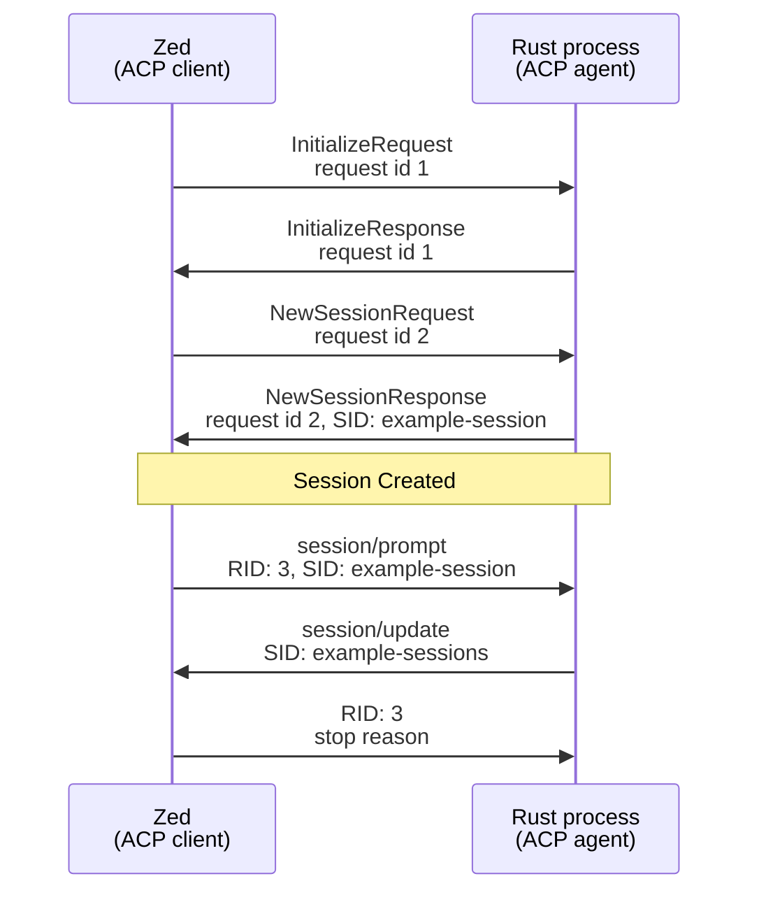

# Lab 00 worksheet — Inspect the current boundary

Start with [One agent, two frontends](00-architecture.md), then use this worksheet to apply its architecture to the current source.

**Prerequisites:** current repo, no API credentials needed. **Deliverable:** your explanation, not code.

## Why this lab exists

ACP is a bidirectional stateful protocol. Your CLI is a one-shot application. Before adding another frontend, identify who owns history, who emits output, and who can stop ongoing work. This is the same architectural reasoning used for HTTP handlers and background jobs, now with Rust ownership made explicit.

## 1. Establish the baseline

From the repository root, type:

```sh
cargo check --locked
cargo test --locked
```

`check` type-checks without building the final executable. `test` compiles and runs registered tests. `--locked` refuses dependency resolution that would change `Cargo.lock`.

**Rationale:** a pre-existing failure must not be attributed to adding ACP.

Guide-creation observation: both commands passed; the test runner found **zero tests**. That is not a behavioral regression suite.

## 2. Find ownership in `src/agent.rs:7–15`

Read the signature of `run` and the initialization of `messages`. 

Answer before reading further:

- Who owns `prompt`? Why can the function consume it?
- Who owns the `Client`? What does `&Client<OpenAIConfig>` say?
- What happens to the `messages` vector when this call returns?
- If Zed calls your adapter twice with one session ID, would two calls to the existing `run` share history?

### Answers:
- As of present, the run function owns `prompt` because we are passing this in directly. `run` passes the prompt into the messages list. It does not get returned or used further. I am not sure how `json!` consumes it, but I think we probably could use this by rferences.
- Client is passed into `run` from `main`. `&Client<OpenAIConfig>` says this is a non-mutable reference.
- `messages` is local to the `run` function, so it's lifetime is tied to the `run` function's execution.
- At present, if Zed calls into the adapter twice with one session ID, it would not share history. Messages is local to the `run` function.

**Rationale:** a session is application state, not something the wire protocol can infer from two requests.

## 3. Follow output in `src/agent.rs:59–64` and `src/main.rs:18–24`

Find the final `println!` and the tracing writer. Classify each as protocol output, diagnostic output, or human CLI output.

Write this prediction in your own notes:

> If I launch the unchanged program behind an ACP transport, the final answer will ______ because stdout must contain ______.

**Rationale:** changing logging alone cannot fix raw application output.

### Answers
agent:61 prints the output for the user.
The tracing sends the output to stderr.

If I launch the unchanged program behind an ACP transport, the final answer will fail the protocol because stdout must contain JSON/RPC messages from the ACP protocol.


## 4. Follow exits and tool work

Read `src/agent.rs:39–50,81–86` and `src/tools.rs:120–137`.

- Which failures currently return success from the Rust function?
- Is process-spawn success the same as command-exit success?
- Does `.output()` return text or bytes? How does the current JSON serialize them?
- Which future task would receive cancellation while the current synchronous tool runs?
- Which cwd does the command inherit today, and how would a session-specific cwd differ?

**Rationale:** these observations define the behavior your later adapter must preserve, fix, or explicitly translate.

### Answers
- Which failures currently return success from the Rust function?
- Malformed OpenRouter response 
- No choices returned from the provider
- We can exceed the max loops and return Ok(), too.
- The bash tool returns an error if it cannot execute the tool.

Is process-spawn success the same as command-exit success?
No, the Bash command returns a JSON-shaped error if it encounters a problem. If the command succeeds, we return the output. It would be idea to keep the same shape as the output.

- Does `.output()` return text or bytes? How does the current JSON serialize them?
`.output()` returns a struct Output object. stdout and stderr fields are Vec<u8>, so presumably thsse are bytes and not ASCII text.

- Which future task would receive cancellation while the current synchronous tool runs?

I don't know.

- Which cwd does the command inherit today, and how would a session-specific cwd differ?

I don't know.

## 5. Read and draw the wire exchange


Read the wiki's [API map](file:///Users/peter/knowledge-bundles/harness-engineering/protocols/acp-api-map.md). Draw Zed and your process as two columns. Add initialization, session creation, prompt, update, and final response. Label request IDs and session IDs separately.

Then add a permission request going in the opposite direction **while the prompt request is still pending**.

**Rationale:** this exposes why a one-request-at-a-time “read → compute everything → reply” loop is insufficient.


## Checkpoint — teach it back

Tell Hermes:

1. Where should conversation history live?
2. Why must ACP output be separated from CLI presentation?
3. Which task must remain responsive during a model/tool wait?
4. What would you test before allowing a write from Zed?

Do not change the source yet. Hermes reviews your answers, records actual evidence in [progress.md](progress.md), and helps choose the next small change.

[Architecture lesson](00-architecture.md) · [Course](README.md) · [Next: handshake](01-handshake.md)
